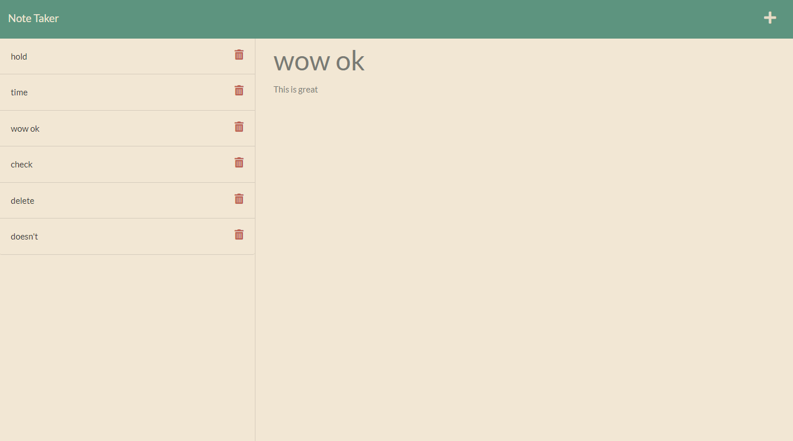

# **Note Taker**

## **Description**

This is a note taking app.  You can use it to gather your thoughts and tasks to help you stay focused on what's important!  This app uses express and node to save and display your notes.

## **Installation**

To install the Note Taker app, you can clone the code from my GitHub repository.  After cloning the code simply install the dependencies from the package.json file.

## **Usage**

If you don't wish to install the application locally, you can access it through the *[heroku url](https://shrouded-oasis-66135.herokuapp.com/)*.  If you do install locally, simply run npm start in your terminal to get the server running!  All interaction afterwards is in the browser.

## **Screenshot**

## **Questions**

You can check out my other projects on GitHub at *[wbruns](https://github.com/wbruns)*.